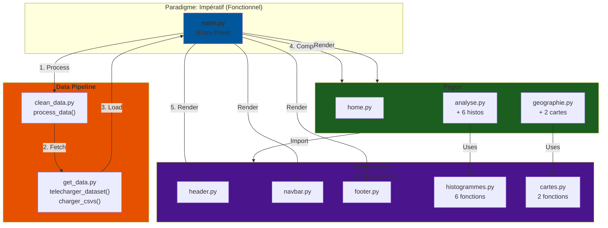
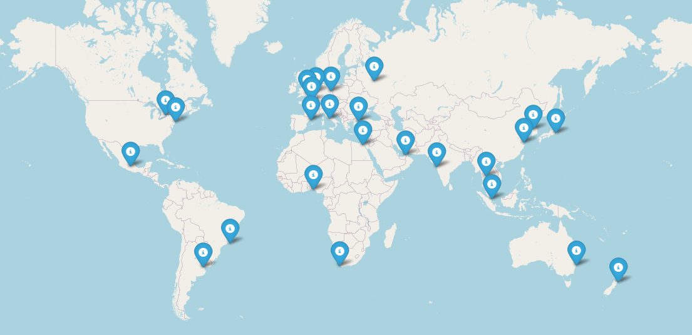
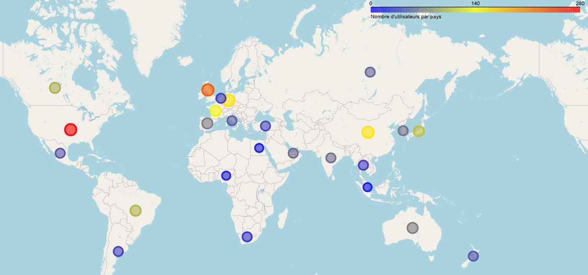

<h1 align="center">International Hotel Booking Analytics</h1>

Ce projet propose un dashboard interactif construit à partir du dataset public https://www.kaggle.com/datasets/alperenmyung/international-hotel-booking-analytics.
 
L’objectif est d’explorer et de visualiser les tendances du secteur hôtelier international à travers des données réelles sur les hôtels et leurs utilisateurs.
  

# Pourquoi ce projet ? 

Le tourisme joue un rôle clé dans l’économie mondiale et dans la vitalité des territoires. Grâce à l’analyse des données de réservations hôtelières internationales, ce projet aide à mieux comprendre les habitudes de voyage, les périodes de forte affluence et les comportements des clients. Ces analyses contribuent à un tourisme plus durable et plus responsable, au bénéfice des voyageurs et des communautés locales.
  
De plus, les voyageurs aujourd'hui recherchent avant tout une expérience de luxe, alliant confort, service de qualité et moments mémorables. Ils souhaitent vivre des séjours uniques, conçus pour répondre à leurs envies et valoriser pleinement leur temps libre. Cette quête d'exclusivité fait du tourisme haut de gamme un pilier important de l'économie mondiale.

# User Guide

Pour pouvoir utiliser le dashboard interactif, il faut : 

1 - Assurez vous davoir installer en amont Python, si possible la dernière version avec pip par [ici](https://www.python.org/downloads/). Vous pouvez également le logiciel [Git](https://git-scm.com/install/).

2 - Une fois installé, ouvrez Git Bash et clonez le projet avec l'aide des commandes : 

<pre>$ git clone https://github.com/<Nom-du-repo>/Project-data.git
cd Project_data
</pre>

Ou bien téléchargez directment via un dossier ZIP puis ouvrez sur un terminal dans le dossier du projet.

3 - Installez les dépendances via : 

<pre>pip install -r requirements.txt
</pre>

4 - Lancer maintenant : 

<pre>python main.py
</pre>

le dashboard démarrera sur un lien. Ouvrez le pour obtenir le dashboard.

# Data

## Présentation des données

Le dataset public regroupe des informations sur des hôtels internationaux et leurs clients. Il s'agit d'une base relationnelle composée de trois fichiers CSV : 

### hotels.csv :
Ce fichier recense les données de 25 hôtels cinq étoiles localisées sur l'ensemble des continents. Chaque hôtel est identifié par un ID unique et accompagné de plusieurs notes de base évaluant dofférents critères de qualité : 

 | **Nom du paramètre** | **Description**                                                                                                                                      |
| -------------------- | ---------------------------------------------------------------------------------------------------------------------------------------------------- |
| hotel_id             | Identifiant unique de l’hôtel.                                                                                                                       |
| hotel_name           | Nom complet de l’hôtel (ex. : The Azure Tower).                                                                                                      |
| city                 | Ville où se situe l’hôtel.                                                                                                                           |
| country              | Pays où se situe l’hôtel.                                                                                                                            |
| star_rating          | Nombre d’étoiles officielles attribuées à l’hôtel.                                                                                         |
| lat                  | Latitude géographique de l’hôtel en decimal.                                                                                                         | 
| lon                  | Longitude géographique de l’hôtel en decimal.                                                                                                        |
| cleanliness_base     | Note moyenne de base sur la propreté(sur 10).                                                                                                   |
| comfort_base         | Note moyenne de base sur le confort (sur 10).                                                                                                    |
| facilities_base      | Note moyenne de base sur les équipements et installations(sur 10).                                                                              |
| location_base        | Note moyenne de base sur la localisation (sur 10).                                                                                               |
| staff_base           | Note moyenne de base sur le personnel (amabilité, professionnalisme, disponibilité) (sur 10).                                                    |
| value_for_money_base | Note moyenne de base sur le rapport qualité/prix (sur 10).                                                                                       |

### users.csv :
Ce fichier fournit des données démographiques sur les utilisateurs ayant séjourné dans les hôtels (âge, genre, pays,...) :

 | **Nom du paramètre** | **Description**                                                                                                                                      |
| -------------------- | ---------------------------------------------------------------------------------------------------------------------------------------------------- |
| user_id             | Identifiant unique du client.                                                                                                                       |
| user_gender           | Sexe/Genre de la personne réservante.                                                                                                      |
| country                 | Pays où le client est résident                                                                                                                           |
| age_group              | Tranche d'âge du client                                                                                                                            |
| traveller_type          | Cause du voyage (ex : Voyage solo, familiale, Business,...)                                                                                         |
| join_date                  | Date à laquelle le client a commencé son séjour à l'hôtel.                                                                                                 | 
   
                                                                                     
### reviews.csv :
Ce fichiers fournit les avis et notes des clients selon l'hôtel auquel ils ont séjourné. Il est donc à la fois lié à users.csv et hotels.csv pour effectuer des analyses croisées :

 | **Nom du paramètre** | **Description**                                                                                                                                      |
| -------------------- | ---------------------------------------------------------------------------------------------------------------------------------------------------- |
| review_id             | Identifiant unique de la review.                                                                                                                       |
| user_id           | Identifiant unique du client.                                                                                                      |
| hotel_id                 | Identifiant unique de l’hôtel.                                                                                                                           |
| review_date              | Date de l'émission de la review.                                                                                                                            |
| score_overall          | Moyenne globale de l'expérience à l'hôtel du client (sur 10).                                                                                         |
| score_cleanliness                  | Note du client sur la propreté de l'hôtel du client (sur 10).                                                                                                         | 
| score_comfort                 | Note du client sur le confort de l'hôtel du client (sur 10).                                                                                                        |
| score_facilities     | Note du client sur les équipements et installations de l'hôtel (sur 10).                                                                                                   |
| score_location         | Note du client sur la localisation de l'hôtel (sur 10).                                                                                                    |
| score_staff      | Note du client sur le personnel de l'hôtel (amabilité, professionnalisme, disponibilité) (sur 10).                                                                              |
| score_value_for_money        | Note du client sur le rapport qualité/prix de l'hôtel (sur 10)                                                                                              |
| review_text           | Informations supplémentaires sur l'expérience à l'hôtel.                                                    |

## Traitement des données

Avant d'utiliser les données pour réaliser notre dashboard, nous devons stocker et nettoyer nos tableaux de possibles erreurs. Pour ce faire, on vient alors créer deux fichiers principaux : 

- get_data.py : Fichier contenant le script de récupération des données.
- clean_data.py : Fichier contenant le script de nettoyage des données.

Cette structure permet de pouvoir gérer les deux fonctions indépendamment l'un de l'autre.

#### Variables réccurentes

Nous vous présentons plusieurs variables qui reviendront dans les 2 fonctions : 

- PROJECT_ROOT : Cette variable est spécifique ; elle se positionne automatiquement à la racine du projet, quel que soit le dossier depuis lequel le code est exécuté. En effet, les appels de fonctions généralement se font au sein d'une même pipeline et de ce fait, leurs effets se limitent à cette dernière. En forçant la constante à commencer à un point précis, on s'assure alors à ce que la création de fichiers soit positionné correctement.

-  DATA_DIR : Constante qui s'assure de créer le chemin vers le dossier "data" à partir de la racine du projet. 
-  RAW_DATA_PATH : Constante qui s'assure de créer le chemin vers le sous-dossier "data/raw/".
-  CLEAN_DATA_PATH :  Constante qui s'assure de créer le chemin vers le sous-dossier "data/cleaned/".
- KAGGLE_MODEL_SLUG : Variable contenant le lien du dataset à télécharger.

- DATA_FILES : Liste de fichiers attendus dans le dataset. Ceci nous sera utile par exemple, si l'on voudra retrouver certains tableaux. 

### get_data : 

get_data.py a pour objectif de télécharger le dataset, puis copier tous les fichiers CSV dans un répertoire local. On définit une fonction telecharger_dataset(), prenant le nom du dataset en paramètre, qui retourne le chemin qui nous permettra de charger nos fichiers dans le dossier data/raw.

- On vérifie que notre dossier "data/raw" est bien été créé.
- On vérifie également que nos fichiers CSV n'existent pas déjà dans ces dossiers, afin d'éviter de les retélécharger.
- Une fois ces vérifications faites, on vient tout d'abord télécharger notre dataset via la fonction de kagglehub dataset_download().
- Enfin, on réalise un parcours de boucle : pour chaque fichier CSV se trouvant dans notre dossier, on le copie et le placer dans notre dossier se trouvant dans le chemin RAW_DATA_PATH.
- Si une erreur survient, l'exception est capturée et un message d'erreur est affiché.
- On retourne le chemin d'accès aux fichiers CSV.

**Code Python**

<pre>def telecharger_dataset(nom_dataset: str) -> str:
    """
    Télécharge (ou récupère depuis le cache) un dataset Kaggle via kagglehub.
    Retourne le chemin du dossier contenant les fichiers CSV.
    param nom_dataset: Nom du dataset Kaggle (format "utilisateur/dataset").
    """
    os.makedirs(RAW_DATA_PATH, exist_ok=True)
    # Si des CSV nettoyés sont présents localement, les utiliser en priorité
    if os.path.isdir(RAW_DATA_PATH):
        csvs = [f for f in os.listdir(RAW_DATA_PATH) if f.endswith('.csv')]
        if csvs:
            print(f"Utilisation des données locales dans {RAW_DATA_PATH}")
            return RAW_DATA_PATH

    # Sinon tenter de télécharger via kagglehub (peut nécessiter configuration Kaggle)
    path = kagglehub.dataset_download(nom_dataset)

    fichiers_csv = []
    for root, dirs, files in os.walk(path):
        for file in files:
            if file.endswith(".csv"):
                src = os.path.join(root, file)
                dst = os.path.join(RAW_DATA_PATH, file)
                shutil.copy(src, dst)
                fichiers_csv.append(file)

    if not fichiers_csv:
        print("Aucun fichier CSV trouvé dans le dataset Kaggle.")
    else:
        print(f"CSV copiés dans {RAW_DATA_PATH} : {fichiers_csv}")
    return path
 </pre>

On définit également une fonction charger_csvs(), nous permettent de charger les fichiers CSV obtenus dans des DataFrames pandas et les retourne sous forme de dictionnaire. Il prend en paramètre le chemin d'accès de fichier.

- Tout d'abord, on liste tous les CSV du dossier, initialise un dictionnaire pour les DataFrames.
- Une fois cela fait, nous récupérons un par un les fichiers et retournons le dictionnaire.

**Code Python**

<pre>def charger_csvs(path: str) -> dict[str, pd.DataFrame]:
    """
    Charge tous les fichiers CSV présents dans un dossier en DataFrames pandas.
    """
    csv_files = [f for f in os.listdir(path) if f.endswith(".csv")]
    dfs: dict[str, pd.DataFrame] = {}
    for csv_file in csv_files:
        csv_path = os.path.join(path, csv_file)
        # Lire le CSV
        df = pd.read_csv(csv_path)
        # Normaliser la clé : si les fichiers sont préfixés par 'cleaned_'
        # on expose la version sans préfixe pour correspondre aux clés
        # attendues (par ex. 'reviews.csv', 'hotels.csv').
        key = csv_file
        if csv_file.startswith("cleaned_"):
            key = csv_file[len("cleaned_"):]
        dfs[key] = df
    return dfs
 </pre>

<strong> ==> On récupère ainsi l’ensemble des CSV bruts téléchargés.</strong>

### clean_data : 

clean_data.py a pour objectif de charger les fichiers CSV bruts, de les nettoyer en appliquant des règles spécifiques à chaque tableau, puis d’enregistrer les résultats dans un dossier data/cleaned. Pour cela, on définit une fonction principale process_data(), sans paramètre ni valeur de retour, qui orchestre toute la procédure de nettoyage.

- Comme dans get_data.py, on vérifie que nos dossiers et sous-dossiers existents déjà ou non.
- On définit individuellement des fonctions dédiées au nettoyage des 3 tableaux CSV (clean_hotels(), clean_users(), clean_reviews()).
- Pour chaque fichier, on récupère le dataset via telecharger_dataset(KAGGLE_MODEL_SLUG) et le fichier CSV correspondant est lu depuis ce dossier téléchargé.
- On définit un dictionnaire CLEANING_FUNCTIONS qui associe chaque nom de fichier à une fonction de nettoyage dédiée : clean_hotels(), clean_users(), clean_reviews()
- Une fois le DataFrame nettoyé, il est enregistré dans un nouveau fichier CSV, sous un nouveau de type "cleaned_nom-du-tableur-original". Ces fichiers sont placés dans le répertoire défini par CLEAN_DATA_PATH.

<strong> ==> À l’issue de l’exécution du script, nous disposons alors de versions nettoyées, homogènes, prêtes pour les analyses et la construction du dashboard déposées dans un dossier data/cleaned. </strong>

# Developer Guide

Nous avons une architecture classique : 

<pre>Project_data
|-- .gitignore
|-- main.py                                     # fichier principal permettant de lancer le dashboard
|-- requirements.txt                            # liste des packages additionnels requis
|-- README.md
|-- data                                        # les données
│   |-- cleaned
│   │   |-- cleaned_hotels.csv
│   │   |-- cleaned_reviews.csv
│   │   |-- cleaned_users.csv
│   |-- raw
│   │   |-- hotels.csv
│   │   |-- reviews.csv
│   │   |-- users.csv
|-- images                                      # images utilisées dans le README
|-- outputs                                     # images des graphiques/cartes
│   |-- figures
│   |-- maps
|-- src                                         # le code source du dashboard
|   |-- components                              # les composants du dashboard
|   |   |-- __init__.py
|   |   |-- histogrammes.py
|   |   |-- cartes.py
|   |   |-- footer.py
|   |   |-- header.py
|   |   |-- navbar.py
|   |-- pages                                   # les pages du dashboard
|   |   |-- __init__.py
|   |   |-- geographie.py
|   |   |-- home.py
|   |   |-- analyse.py
|   |-- utils                                   # les fonctions utilitaires
|   |   |-- __init__.py
|   |   |-- get_data.py                         # script de récupération des données
|   |   |-- clean_data.py                       # script de nettoyage des données
|-- video.mp4
</pre>

## Décomposition : 
### Racine du projet 

- .gitignore : Ce fichier permet d'exclure certains dossiers/fichiers temporaires.
- requirements.txt : Liste de package Python nécessaire au bon fonctionnement du projet. Il garantit que l'environnement possède toutes les dépendances adéquates.
- images : Dossier regroupant les images pour le README.
- outputs : Images des schémas utilisés pour le dashboard (non utilisé pour le dashboard).
- video.mp4 : Video de démonstration du dashboard.
- main.py : Script principal permettant de lancer le dashboard.
- README.md : Documentation générale du projet : objectifs, installation, organisation...
- data : Ce dossier contient l’ensemble des données brutes et nettoyées utilisées dans les analyses et le dashboard.

### Dossier data : les données du projet

- raw : Dossier comportant les tableaux CSV récupérées depuis Kaggle.
- cleaned : Dossier comportant les tableaux nettoyés CSV.

### Dossier src : Code source du dashboard
Il regroupe tout le code Python lié au dashboard et est divisé en sous-modules pour une meilleure organisation. 

**Components**  
Ce dossier contient les composants graphiques du dashboard.

- header.py : en-tête du dashboard
- navbar.py : barre de navigation
- footer.py : pied de page
- histogrammes.py : graphiques personnalisés
- cartes.py : cartes interactives

**pages**   
Ce dossier contient les pages du dashboard, et leur contenu.

- home.py : page d'accueil (présentation du projet)
- analyse.py : analyses statistiques (histogrammes)
- geographie.py : visualisations géographiques (cartes)

**utils**  
Ce dossier contient les fonctions utilitaires nécessaires à la préparation des données.

- get_data.py : Téléchargement des données brutes depuis Kaggle et copie dans data/raw/
- clean_data.py : Nettoyage des données brutes et génération des fichiers dans data/cleaned/

### Représentation graphique

# Rapport d'analyse

Tout d'abord, nous avons réalisé 2 cartes : une représentant les lieux où sont localisés les hôtels particuliers et une autre montrant cette fois-ci le nombre de voyageurs par pays qui sont partis dans ces différents hôtels : 

--> On remarque alors une forte concentration des hôtels riches dans l'Ouest de l'Europe et en Asie de l'Est.
--> On voit aussi que selon la cartes des voyageurs, le plus grand taux de voyegeurs partant dans les hôtels sont en Amérique et en Angleterre, contrairement à l'Afrique où on avoisine le 0. 

On peut expliquer cela pour plusieurs raisons : 

- La force du dollar et de la livre sterling rend l'Europe plus accessible : en effet, les coûts européens peuvent être un avantage quant au choix des consommateurs pour leurs vacances. Dans certains pays, la vie est peu cher et donc s'offrir un voyage de luxe dans de bonnes conditions est possible.
  
- Egalement la curiosité culturelle peut jour : dans des pays comme l'Asie ou le Moyen-Orient, les clients recherchent parfois un dépaysement, une envie de changer d'envrionnement culturel, afin de garder des souvenirs. Cela est beaucoup voulu pour ceux vivant des sociétés déjà 'technologiques', de désirer une culture plus calme et exotique.

Si on cherche maintenant sur la qualité des hôtels : nous avons tracé beaucoup d'histogrammes regroupant les notes que donnent les clients sur différents services : 

**Exemple**

(Mettre histogrammes, maps, ....) 

*(Présente ici les principales conclusions issues de ton analyse de données : tendances, corrélations, résultats clés, etc.)*

# Limites / Perspectives d'avenir

Même si nous sommes fiers de notre projet, on peut voir qu'il reste des points d'analyse que l'on aurait pu effecteur avec un temps plus conséquent. 

## Limites
Nous avons rencontré certaines limites au cours du projet. 

### Qualité des données
Notre jeu de données avait la chance de ne pas nécissiter d'importants nettoyages : on n'a observé ni caractères spéciaux cachés, ni conversions de colonnes douteuses ou encore de données manquantes sur les lignes. De façon générale, elle étaiet facilement exploitable et riche en information.  
Seulement, certaines colonne restaient difficellement exploitables : 
- hotels.csv : colonne 'star_rating' inintéressante car la même note partout, colonne 'country' avec très peu de données.
- reviews.csv : colonne 'review_text' inexploitable car le contenu est sens dessus dessous.

### Analyses rapides

Ceci engendre alors le problème suivant : malgré le faible taux de données inutiles, le reste des données montratit une redondance. Dans tous les tableaux CSV quasiment, il était question de notes sur différents critères. De plus, ces notes n'étaient pas non très variantes, allant de 7,4 et 10. Ceci nous a évidemment contraint nos analyses, qui sont alors très répétitives surtout sur nos histogrammes. Ces données étaient également les seuls à contenir des variables non catégorielles et, étant donné l'importance de celles-ci, nous devions alors réaliser ces graphiques. 

## Perspectives d'avenir 

Avec plus de temps et de focalisation, plusieurs axes pourraient être explorées : 

- Tout d'abord, nous aurions pu intégrer des nouvelles sources de données complémentaires : cela aurait permis d'enrichier et renforcer l'analyse. Par exemple, plus d'informations sur les hôtels et savoir quels sont les services qu'ils proposent, aller chercher plus d'hôtels également à analyser.

- Aussi réaliser des analyses croisées plus poussées : faire un classement des hôtels préférés des utilisateurs, voir quels sont les critères les plus importants pour un hôtel de luxe, voir quels sont les périodes de l'année où les voyageurs partent le plus,....

# Copyright

Dans le cadre de ce projet, nous avons eu recours à GitHub Copilot, une IA intégrée à nos IDE, pour nous assister dans le développement. Même si certaines portions du code ont été générées automatiquement, la majeure partie a été écrite par nous-mêmes.

L'architecture de l'arbrescence dans Developer Guide est repris au cours <i>E4-DSIA : Python 2, manipulation de données</i> de Daniel Courivaud, pour des raisons esthétiques.
