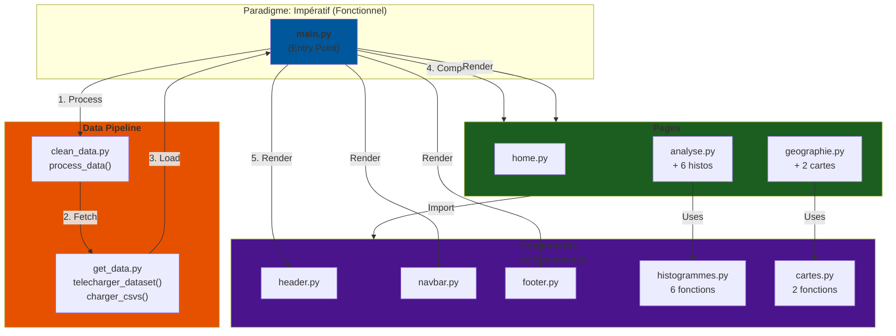

<h1 align="center">International Hotel Booking Analytics</h1>

Ce projet propose un dashboard interactif construit à partir du dataset public https://www.kaggle.com/datasets/alperenmyung/international-hotel-booking-analytics.
 
L’objectif est d’explorer et de visualiser les tendances du secteur hôtelier international à travers des données réelles sur les hôtels et leurs utilisateurs.
  

# Pourquoi ce projet ? 

Le tourisme joue un rôle clé dans l’économie mondiale et dans la vitalité des territoires. Grâce à l’analyse des données de réservations hôtelières internationales, ce projet aide à mieux comprendre les habitudes de voyage, les périodes de forte affluence et les comportements des clients. Ces analyses contribuent à un tourisme plus durable et plus responsable, au bénéfice des voyageurs et des communautés locales.
  
De plus, les voyageurs aujourd'hui recherchent avant tout une expérience de luxe, alliant confort, service de qualité et moments mémorables. Ils souhaitent vivre des séjours uniques, conçus pour répondre à leurs envies et valoriser pleinement leur temps libre. Cette quête d'exclusivité fait du tourisme haut de gamme un pilier important de l'économie mondiale.

# User Guide

*(Décris ici comment déployer et utiliser ton dashboard sur une autre machine : installation, dépendances, lancement, etc.)*

# Data

## Présentation des données

Le dataset public regroupe des informations sur des hôtels internationaux et leurs clients. Il s'agit d'une base relationnelle composée de trois fichiers CSV : 

### hotels.csv :
Ce fichier recense les données de 25 hôtels cinq étoiles localisées sur l'ensemble des continents. Chaque hôtel est identifié par un ID unique et accompagné de plusieurs notes de base évaluant dofférents critères de qualité : 

 | **Nom du paramètre** | **Description**                                                                                                                                      |
| -------------------- | ---------------------------------------------------------------------------------------------------------------------------------------------------- |
| hotel_id             | Identifiant unique de l’hôtel.                                                                                                                       |
| hotel_name           | Nom complet de l’hôtel (ex. : The Azure Tower).                                                                                                      |
| city                 | Ville où se situe l’hôtel.                                                                                                                           |
| country              | Pays où se situe l’hôtel.                                                                                                                            |
| star_rating          | Nombre d’étoiles officielles attribuées à l’hôtel.                                                                                         |
| lat                  | Latitude géographique de l’hôtel en decimal.                                                                                                         | 
| lon                  | Longitude géographique de l’hôtel en decimal.                                                                                                        |
| cleanliness_base     | Note moyenne de base sur la propreté(sur 10).                                                                                                   |
| comfort_base         | Note moyenne de base sur le confort (sur 10).                                                                                                    |
| facilities_base      | Note moyenne de base sur les équipements et installations(sur 10).                                                                              |
| location_base        | Note moyenne de base sur la localisation (sur 10).                                                                                               |
| staff_base           | Note moyenne de base sur le personnel (amabilité, professionnalisme, disponibilité) (sur 10).                                                    |
| value_for_money_base | Note moyenne de base sur le rapport qualité/prix (sur 10).                                                                                       |

### users.csv :
Ce fichier fournit des données démographiques sur les utilisateurs ayant séjourné dans les hôtels (âge, genre, pays,...) :

 | **Nom du paramètre** | **Description**                                                                                                                                      |
| -------------------- | ---------------------------------------------------------------------------------------------------------------------------------------------------- |
| user_id             | Identifiant unique du client.                                                                                                                       |
| user_gender           | Sexe/Genre de la personne réservante.                                                                                                      |
| country                 | Pays où le client est résident                                                                                                                           |
| age_group              | Tranche d'âge du client                                                                                                                            |
| traveller_type          | Cause du voyage (ex : Voyage solo, familiale, Business,...)                                                                                         |
| join_date                  | Date à laquelle le client a commencé son séjour à l'hôtel.                                                                                                 | 
   
                                                                                     
### reviews.csv :
Ce fichiers fournit les avis et notes des clients selon l'hôtel auquel ils ont séjourné. Il est donc à la fois lié à users.csv et hotels.csv pour effectuer des analyses croisées :

 | **Nom du paramètre** | **Description**                                                                                                                                      |
| -------------------- | ---------------------------------------------------------------------------------------------------------------------------------------------------- |
| review_id             | Identifiant unique de la review.                                                                                                                       |
| user_id           | Identifiant unique du client.                                                                                                      |
| hotel_id                 | Identifiant unique de l’hôtel.                                                                                                                           |
| review_date              | Date de l'émission de la review.                                                                                                                            |
| score_overall          | Moyenne globale de l'expérience à l'hôtel du client (sur 10).                                                                                         |
| score_cleanliness                  | Note du client sur la propreté de l'hôtel du client (sur 10).                                                                                                         | 
| score_comfort                 | Note du client sur le confort de l'hôtel du client (sur 10).                                                                                                        |
| score_facilities     | Note du client sur les équipements et installations de l'hôtel (sur 10).                                                                                                   |
| score_location         | Note du client sur la localisation de l'hôtel (sur 10).                                                                                                    |
| score_staff      | Note du client sur le personnel de l'hôtel (amabilité, professionnalisme, disponibilité) (sur 10).                                                                              |
| score_value_for_money        | Note du client sur le rapport qualité/prix de l'hôtel (sur 10)                                                                                              |
| review_text           | Informations supplémentaires sur l'expérience à l'hôtel.                                                    |

## Traitement des données

Avant d'utiliser les données pour réaliser notre dashboard, nous devons stocker et nettoyer nos tableaux de possibles erreurs. Pour ce faire, on vient alors créer deux fichiers principaux : 

- get_data.py : Fichier contenant le script de récupération des données.
- clean_data.py : Fichier contenant le script de nettoyage des données.

Cette structure permet de pouvoir gérer les deux fonctions indépendamment l'un de l'autre.

#### Variables globales

On définit d'abord plusieurs variables globales, qui seront utiles à travers nos 2 principaux modules : 

(Insérer code fichier)

- PROJECT_ROOT : Cette variable est spécifique ; elle se positionne automatiquement à la racine du projet, quel que soit le dossier depuis lequel le code est exécuté. En effet, les appels de fonctions généralement se font au sein d'une même pipeline et de ce fait, leurs effets se limitent à cette dernière. En forçant la constante à commencer à un point précis, on s'assure alors à ce que la création de fichiers soit positionné correctement.

-  DATA_DIR : Constante qui s'assure de créer le chemin vers le dossier "data" à partir de la racine du projet. 
-  RAW_DATA_PATH : Constante qui s'assure de créer le chemin vers le sous-dossier "data/raw/".
-  CLEAN_DATA_PATH :  Constante qui s'assure de créer le chemin vers le sous-dossier "data/cleaned/".
- KAGGLE_MODEL_SLUG : Variable contenant le lien du dataset à télécharger.

- DATA_FILES : Liste de fichiers attendus dans le dataset. Ceci nous sera utile par exemple, si l'on voudra retrouver certains tableaux. 

#### Fonction utilitaires

On vient également définir 2 fonctions, qui l'on utilisera pour les 2 fichiers : 

(Insérer code fonctions)

- ensure_directories(path) : Fonction qui s'assure que nos répertoires de sortie sont créés, sinon les crée automatiquement. Cette fonction assure une sécurité supplémentaire.

- telecharger_dataset(nom_dataset) : Fonction qui permet de télécharger les données depuis un dataset Kaggle. Cette fonction nous sera utile pour avoir une indépendance de nos 2 modules. 

### get_data : 

get_data.py a pour objectif de télécharger le dataset, puis copier tous les fichiers CSV dans un répertoire local. On définit une fonction charger_csvs(), sans paramètre ni retour, qui nous permettra de charger nos fichiers dans le dossier data/raw.

- PROJECT_ROOT : Cette variable est spécifique ; elle se positionne automatiquement à la racine du projet, quel que soit le dossier depuis lequel le code est exécuté. En effet, les appels de fonctions généralement se font au sein d'une même pipeline et de ce fait, leurs effets se limitent à cette dernière. En forçant la constante à commencer à un point précis, on s'assure alors à ce que la création de fichiers soit positionné correctement.

-  DATA_DIR : Constante qui s'assure de créer le chemin vers le dossier "data" à partir de la racine du projet. 
-  RAW_DATA_PATH : Constante qui s'assure de créer le chemin vers le sous-dossier "data/raw/".

(charger image de la fonction)

- On appelle notre fichier common_functions.py pour sortir nos variables et fonctions versatiles. 
- On vient tout d'abord télécharger notre dataset via la fonction telecharger_dataset(nom_dataset).
- On réalise ensuite un parcours de boucle : pour chaque fichier CSV se trouvant dans notre dossier, on le copie et le placer dans notre dossier se trouvant dans le chemin RAW_DATA_PATH.
- Si une erreur survient, l'exception est capturée et un message d'erreur est affiché.

<strong> ==> On récupère ainsi l’ensemble des CSV bruts téléchargés.</strong>

### clean_data : 

clean_data.py a pour objectif de charger les fichiers CSV bruts, de les nettoyer en appliquant des règles spécifiques à chaque tableau, puis d’enregistrer les résultats dans un dossier data/cleaned. Pour cela, on définit une fonction principale process_data(), sans paramètre ni valeur de retour, qui orchestre toute la procédure de nettoyage.

- Comme dans get_data.py, on importe les variables importantes et les fonctions utilitaires depuis common_functions.py (chemins des dossiers, noms de fichiers, fonction de téléchargement…).
- On définit individuellement des fonctions dédiées au nettoyage des 3 tableaux CSV (clean_hotels(), clean_users(), clean_reviews()).
- Pour chaque fichier : On récupère le dataset via telecharger_dataset(KAGGLE_MODEL_SLUG) et le fichier CSV correspondant est lu depuis ce dossier téléchargé.
- On définit un dictionnaire CLEANING_FUNCTIONS qui associe chaque nom de fichier à une fonction de nettoyage dédiée : clean_hotels(), clean_users(), clean_reviews()
- Une fois le DataFrame nettoyé, il est enregistré dans un nouveau fichier CSV, sous un nouveau de type "cleaned_<nom-du-tableur-original>". Ces fichiers sont placés dans le répertoire défini par CLEAN_DATA_PATH.

<strong> ==> À l’issue de l’exécution du script, nous disposons alors de versions nettoyées, homogènes, prêtes pour les analyses et la construction du dashboard déposées dans un dossier data/cleaned. </strong>

# Developer Guide

Nous avons une architecture classique : 

<pre>Project_data
|-- .gitignore
|-- config.py                                   # fichier de configuration
|-- main.py                                     # fichier principal permettant de lancer le dashboard
|-- requirements.txt                            # liste des packages additionnels requis
|-- README.md
|-- data                                        # les données
│   |-- cleaned
│   │   |-- cleaned_hotels.csv
│   │   |-- cleaned_reviews.csv
│   │   |-- cleaned_users.csv
│   |-- raw
│   │   |-- hotels.csv
│   │   |-- reviews.csv
│   │   |-- users.csv
|-- images                                      # images utilisées dans le README
|-- src                                         # le code source du dashboard
|   |-- components                              # les composants du dashboard
|   |   |-- __init__.py
|   |   |-- histogrammes.py
|   |   |-- cartes.py
|   |   |-- footer.py
|   |   |-- header.py
|   |   |-- navbar.py
|   |-- pages                                   # les pages du dashboard
|   |   |-- __init__.py
|   |   |-- geographie.py
|   |   |-- home.py
|   |   |-- analyse.py
|   |-- utils                                   # les fonctions utilitaires
|   |   |-- __init__.py
|   |   |-- common_functions.py
|   |   |-- get_data.py                         # script de récupération des données
|   |   |-- clean_data.py                       # script de nettoyage des données
|-- video.mp4
</pre>

Décomposition : 

**Developer Guide**

# Rapport d'analyse

(Mettre histogrammes, maps, ....) 

*(Présente ici les principales conclusions issues de ton analyse de données : tendances, corrélations, résultats clés, etc.)*

# Point d'amélioration / Perspectives d'avenir

# Copyright

*(Indique ici que le code est original, éventuellement sous quelle licence il est publié, et à qui il appartient.)*

@ architecture : modèle prof
